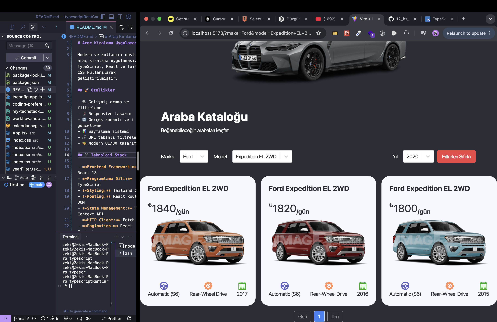

# Araç Kiralama Uygulaması

Modern ve kullanıcı dostu bir araç kiralama uygulaması. TypeScript, React ve Tailwind CSS kullanılarak geliştirilmiştir.

## 🚀 Özellikler

- 🔍 Gelişmiş arama ve filtreleme
- 📱 Responsive tasarım
- 🔄 Gerçek zamanlı veri güncelleme
- 📊 Sayfalama sistemi
- 🔗 URL tabanlı filtreleme
- 🎨 Modern UI/UX tasarımı

## 🛠️ Teknoloji Stack

- **Frontend Framework:** React 18
- **Programlama Dili:** TypeScript
- **Styling:** Tailwind CSS
- **Routing:** React Router DOM
- **State Management:** React Context API
- **HTTP Client:** Fetch API
- **Pagination:** React Paginate
- **Build Tool:** Vite

## 📦 Kurulum

1. Projeyi klonlayın:

```bash
git clone https://github.com/yourusername/car-rental-app.git
```

2. Bağımlılıkları yükleyin:

```bash
cd car-rental-app
npm install
```

3. Geliştirme sunucusunu başlatın:

```bash
npm run dev
```

## 🎯 Kullanım

- **Ana Sayfa:** Tüm araçları listeler
- **Arama:** Marka, model ve yıla göre filtreleme
- **Detay Sayfası:** Araç detaylarını gösterir
- **Filtreler:** URL parametreleri ile paylaşılabilir

## 🔍 API Entegrasyonu

Uygulama, OpenDataSoft API'sini kullanarak araç verilerini çeker:

- Marka listesi
- Model listesi
- Yıl listesi
- Araç detayları

## 🧪 Test

```bash
npm run test
```



## 🙏 Teşekkürler

- OpenDataSoft API ekibi
- Tüm katkıda bulunanlar
